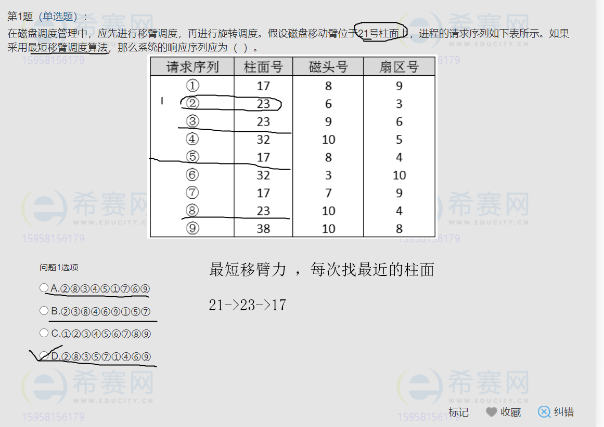

- 移动路线已经找到 21->23->17->32->38
  - 根据 21 排除C (ABD)
  - 柱面号 23 (2，3，8 ) 序号都可以没有顺序
  - 找17 的柱面 (5序号)
  - 满足的只有D 

- 暂时没有找到计算规则

- 自然连接是AND 

- **总线不可改**

- G（x) 使用2代替

  - 2^5 + 2^3 +2 + 1

    32+8+2+1

    100000

    1000

    10

    1

    = 101011

最高位左移 5 位

111000110(00000) / 101011

