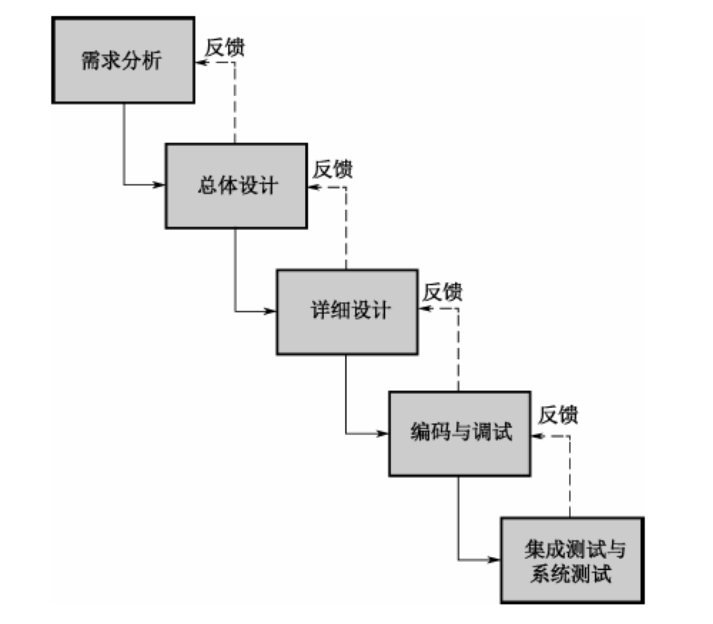
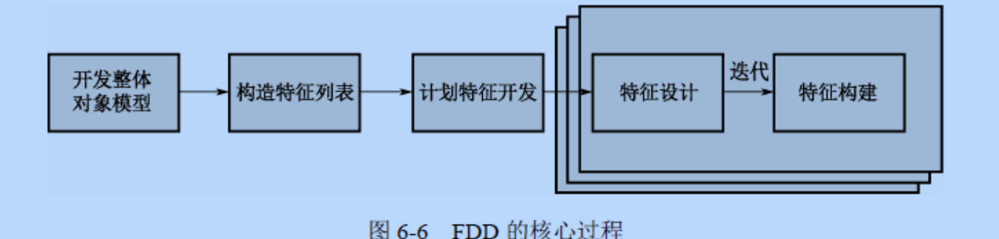

# 开发方法

## 软件生命周期

1. **可行性研究与计划**

   - 通过可行性研究来确定开发此软件的必要性，并根据可行性研究的结果初步确定软件的目标、范围、风险、开发成本等内容。
   - 可行性研究的产物
     1. **可行性研究报告**
     2. **软件开发计划**

2. **需求分析**

   - 需求分析是软件开发的重要阶段

3. **概要设计**

   -  概要设计将决定整个软件的技术蓝图
   - 在概要设计中需要确定**系统架构、各子系统见得关系、接口规约、数据库模型、编码规范等内容**
   - 概要设计的结果将成为程序员的工作指南，拱程序员了解系统内部原理，并在其基础上进行详细设计和编码工作

4. **详细设计**

   - 在概要设计的基础上进行细化。

5. **实现**

   - 实现过程包括编码和单元测试。

     - 编码

       具体的代码实现

     - 单元测试:

       对钢管编写的一个小的程序进行单元测试，如某一个过程、方法或函数。

6. **集成测试**

   - 集成测试又称为组装测试。通过单元测试的程序不代表就没有缺陷。当程序单元被组装到一起(集成起来)进行交互的时候，往往会出现单元测试中发现不了的问题。

7. **确认测试**

   - 当集成测试后，软件之间的接口方面错误已经排除，这时候需要验证软件是否通需求一致，是否达到了逾期目标

8. **使用和维护**

   - 通过了确认测试将软件投入生产也会有问题出现，此时需要进行维护解决这些问题。

## 软件开发方法
### 净室方法
- 使用盒结构规约进行分析和设计建模,并且强调正确性作为发现和消除错误的主要机制.
- 黑盒
    刻划系统或系统的某部分的行为
- 状态盒
    类似于对象的方式封装状态数据和服务
- 清晰盒
    在清晰盒中定义状态盒所蕴含的变迁功能
    
### 结构化方法
- 自顶向下，逐步求精
- 生命周期
    1. 结构化分析
    2. 结构化设计
    3. 结构化程序设计
    

- 基本原则
    1. 面向用户的观点
    2. 严格区分工作阶段
    3. 按照系统的观点,自顶向下
    4. 充分考虑变化的情况
    

## 软件开发模型

### 瀑布模型

- 核心思想

  瀑布模型认为，软件开发是一个阶段化的精确的过程。

  软件需要经过**需求分析、总体设计、湘西设计、编码、调试、集成测试、系统测试**阶段才能北准确的实现

- 特点

  软件开发的阶段划分是明确的。一个阶段到下一个阶段有明确的界限，在每个阶段结束后，都会有固定的文档或者源代码流入到下一个阶段

  - 产物

    **需求分析** -> **明确描述软件需求的文档(需求文档)**

    **总体设计-> 描述软件总体结构的文档**

    **详细设计-> 可以用来编码的详细设计文档**

    **编码-> 源代码**

- **面向文档的软件开发模型**

### 演化模型

- 多次瀑布模型

### 螺旋模型

- 四个阶段
  1. 需求定义
  2. 风险分析
  3. 工程实现
  4. 评审
- 螺旋模型强调**风险分析**
  - 适用于庞大而复杂、具有高风险的系统
- 对比瀑布模型具有如下优点
  1. 支持用户需求的动态变化
  2. 为项目管理人员及时调整管理决策提供了遍历
  3. 提高软件的适应能力
  4. 为用户参与软件开发的所有关键决策提供了方便
- 缺点
  1. 过多的迭代次数会增加开发成本，延迟提交时间
  2. 采用螺旋模型，需要具有相当丰富的风险评估经验和专业知识，在风险将大的项目开发中，如果未能及时标识风险，势必造成重大损失

### 增量模型

1. 增量发布。

   先做好系统的分析和设计工作，将系统分成若干个不同的版本，每个版本都是一个完整的系统，后一个版本以前一个版本为基础进行开发。第一版本往往是系统的核心

2. 原型法

   原型法每次迭代都会有一个完整的生命周期。用户需求不明确的时候可以采用原型法。

### 构建组装模型

- 利用软构建进行搭积木式开发
- 优点
  1. 构件的自包容性让系统的拓展变得更加容易
  2. 设计良好的构件更容易被重用，降低软件开发成本
  3. 构件的粒度相交整个系统更小，因此安排开发任务更加灵活
- 缺点
  - 构件的设计需要经验丰富的架构设计师，设计不良的构件难以实现构件的优点，降低构件组装模型的重用度
  - 在考虑重用度是往往会做出其他方面的让步
  - 使用构件组装应用程序时，要求程序员熟练地掌握构件，增加了研发人员的学习成本
  - 第三方构件库的质量会影响整个软件的质量

## 敏捷方法

### 极限编程

- **极限编程是一种轻量、高效、低风险、柔性、可预测、科学而充满乐趣的软件开发方式**
- 与其他方法的差异
  1. 更短的周期内，更早的提供具体、持续的反馈信息
  2. 迭代的进行计划编制
  3. 依赖于自动测试程序来监控开发进度，并尽早的捕获缺陷
  4. 依赖口头交流、测试和源程序进行沟通
  5. 倡导持续的、演化式的设计
  6. 依赖开发团队内部的紧密协作
  7. 尽可能达到程序员短期利益和项目长远利益的平衡

- 四个价值观
  - 沟通
  - 简单
  - 反馈
  - 勇气

### 特征驱动开发

特征驱动开发定义了六种关键项目角色

1. 项目经理
2. 首席架构师
3. 开发经理
4. 主程序员
5. 程序员
6. 领域专家

核心过程

1. 开发整体对象模型
2. 构造特征列表
3. 计划特征开发
4. 特征设计
5. 特征构建

### scrum

五个活动

1. 产品待办事项列表梳理
2. sprint计划会议
3. 每日scrum会议
4. sprint评审会议
5. sprint回顾会议

### 水晶方法

特征

1. 经常交付
2. 反思改进
3. 渗透式交流
4. 个人安全
5. 焦点
6. 与专家用户建立方便的联系
7. 配有自动测试、配置管理和经常集成功能的技术环境

## 软件重用

- 常见的重用形式
  1. 源代码重用
  2. 架构重用
  3. 应用框架的重用
  4. 业务建模的重用
  5. 文档以及过程的重用
  6. 软构件的重用
  7. 软件服务的重用

### ABSD 基于架构的软件设计

三个基础

1. 功能的分解
2. 通过选择架构风格来实现质量和业务需求
3. 软件模板的使用

方法论

1. 抽象功能需求
2. 用例
3. 抽象的质量和业务的需求
4. 质量因素
5. 架构选项
6. 约束